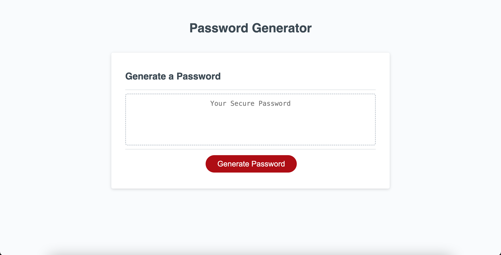
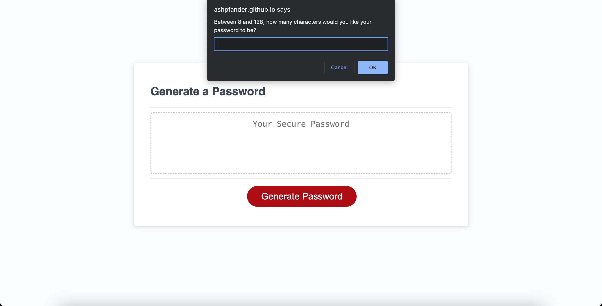
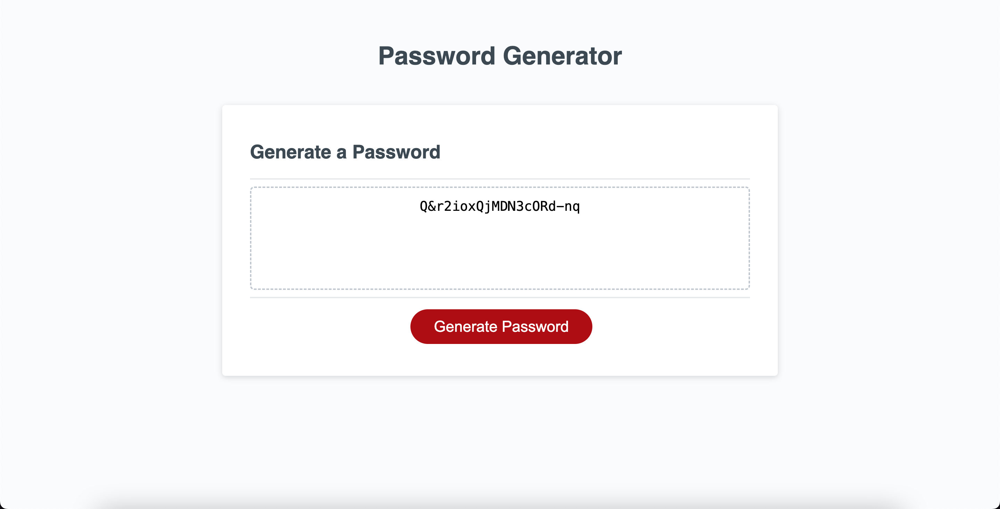

# Challenge 03: Javascript Password Generator

For this week's challenge, I had to take starter code of a password generator webpage and add javascript to make new passwords based on the confirmed criteria. The HTML and CSS were already written and complete. The Javascript file had minimal code in it and I had to figure out what to add to the already existing code for it to meet the User Story and Acceptance Criteria.

## User Story

```
AS AN employee with access to sensitive data
I WANT to randomly generate a password that meets certain criteria
SO THAT I can create a strong password that provides greater security
```

## Acceptance Criteria

```
GIVEN I need a new, secure password
WHEN I click the button to generate a password
THEN I am presented with a series of prompts for password criteria
WHEN prompted for password criteria
THEN I select which criteria to include in the password
WHEN prompted for the length of the password
THEN I choose a length of at least 8 characters and no more than 128 characters
WHEN asked for character types to include in the password
THEN I confirm whether or not to include lowercase, uppercase, numeric, and/or special characters
WHEN I answer each prompt
THEN my input should be validated and at least one character type should be selected
WHEN all prompts are answered
THEN a password is generated that matches the selected criteria
WHEN the password is generated
THEN the password is either displayed in an alert or written to the page
```

## Screenshots of Application

Landing page screen

Once button is clicked, prompts pop up.

Once all prompts have been answered, the generated password appears.


## URL of Deployed Applcation

https://ashpfander.github.io/employee-password-generator/